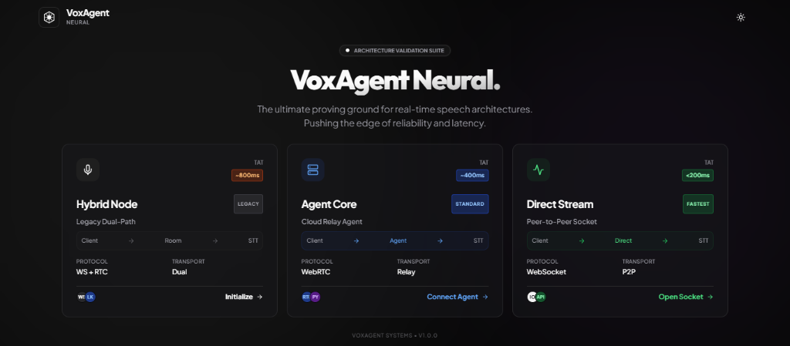
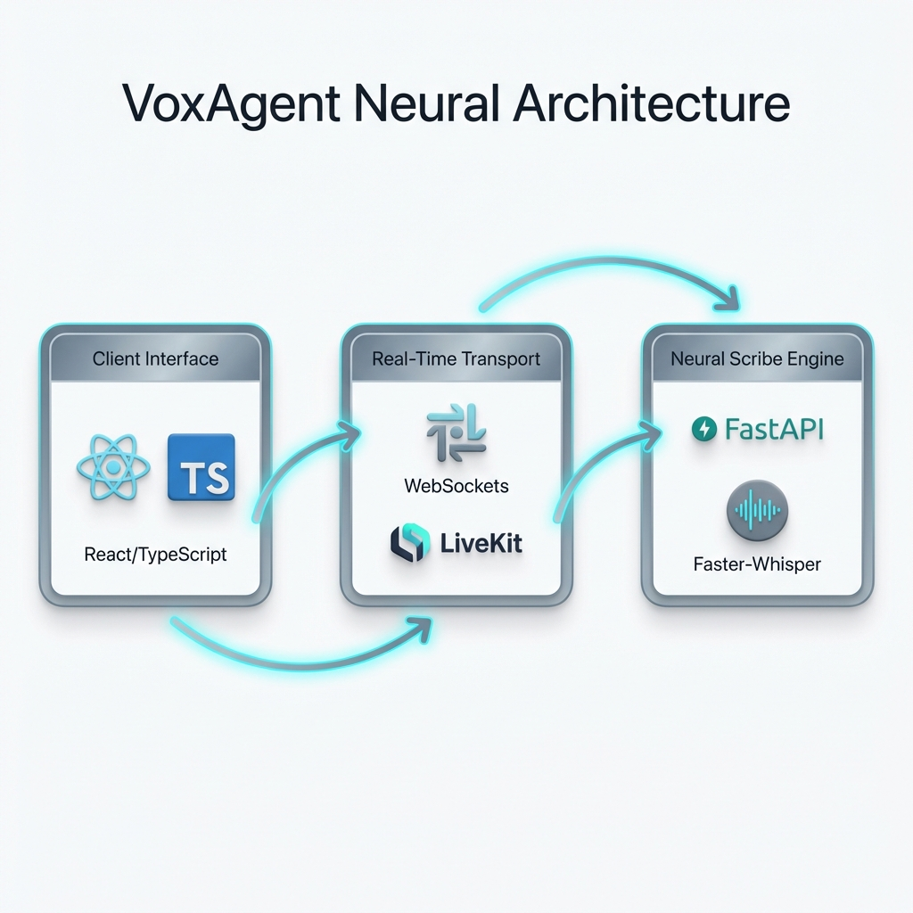
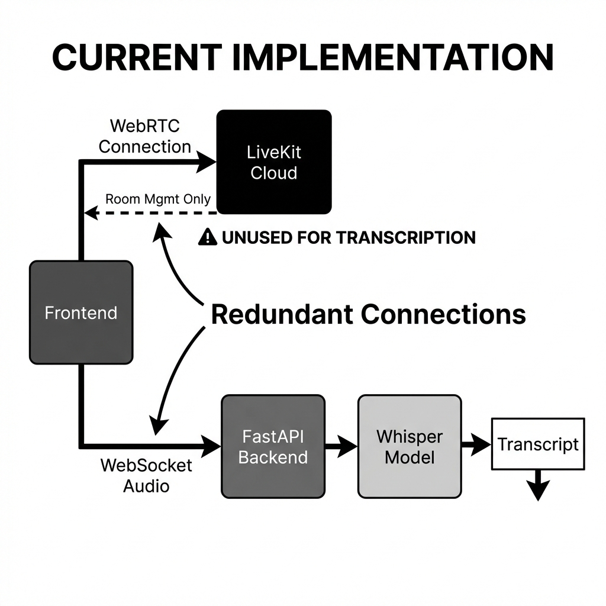

# VoxAgent Neural



## Real-Time Agentic Transcription Engine

<div align="center">


</div>

**VoxAgent Neural** is a high-performance Speech-to-Text platform designed for the **Edge**. Unlike cloud wrappers, it runs a quantized Neural Engine locally (CPU-Optimized), delivering sovereign, low-latency transcription via a persistent Agentic WebSocket connection.

---

## 🚀 Quick Start

Initialize the Neural Link:

```bash
# 1. Start Backend (The Brain)
cd backend && python main.py

# 2. Start Frontend (The Interface)
cd frontend && npm run dev
```

> **Setup Guide**: See [GETTING_STARTED.md](./docs/GETTING_STARTED.md) for Python venv setup.

---

## 📸 Demo & Architecture

### Neural Data Flow

*Audio In -> LiveKit (UDP) -> Quantized Model -> Text Out (TCP)*

### System Architecture

*The Control Plane separating Signal Transport (LiveKit) from Inference (Python)*

### Hybrid Connectivity

*Solving Head-of-Line Blocking by using UDP for Audio and TCP for Text*

> **Deep Dive**: See [ARCHITECTURE.md](./docs/ARCHITECTURE.md) for the "Turnaround Time" logic.

---

## ✨ Key Features

*   **⚡ CPU-Optimized**: Runs `faster-whisper` (INT8) on standard consumer hardware. No GPU needed.
*   **📡 Hybrid Transport**: Combines WebRTC (UDP) for audio stability and WebSocket (TCP) for text reliability.
*   **🕵️ Stealth UI**: Minimalist "Agentic" interface with zero-distraction animations.
*   **⏱️ Latency Awareness**: Real-time "Turnaround Time" (TAT) metrics warn users if they speak too fast.

---

## 📚 Documentation

| Document | Description |
| :--- | :--- |
| [**System Architecture**](./docs/ARCHITECTURE.md) | Hybrid Control Plane & Quantization. |
| [**Getting Started**](./docs/GETTING_STARTED.md) | Python/Node Setup & LiveKit Config. |
| [**Failure Scenarios**](./docs/FAILURE_SCENARIOS.md) | Handling CPU Saturation & Network Jitter. |
| [**Interview Q&A**](./docs/INTERVIEW_QA.md) | "Why Faster-Whisper?" and "UDP vs TCP". |

---

## 🔧 Tech Stack

| Component | Technology | Role |
| :--- | :--- | :--- |
| **Brain** | **FastAPI (Python)** | Inference Engine. |
| **Model** | **Faster-Whisper** | Quantized STT. |
| **Transport** | **LiveKit** | WebRTC Signaling. |
| **Interface** | **React + Vite** | Agent UI. |

---

## 👤 Author

**Harshan Aiyappa**  
Senior Full-Stack Hybrid Engineer  
[GitHub Profile](https://github.com/Kimosabey)

---

## 📝 License

This project is licensed under the MIT License - see the [LICENSE](LICENSE) file for details.
