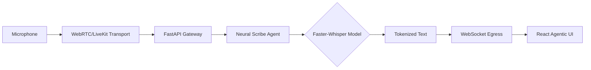

# VoxAgent Neural

> **Real-Time Agentic Transcription & Neural Inference Engine**  
> High-Performance Speech-to-Text via CPU-Optimized Agentic Architecture

[]()
[]()
[]()
[]()
[]()

---

## 📋 Quick Start

### 1. Backend Setup (Neural Engine)
```bash
cd backend
python -m venv venv311
venv311\Scripts\activate
pip install -r requirements.txt
python main.py dev
```

### 2. Frontend Setup (Agentic UI)
```bash
cd frontend
npm install
npm run dev
```

### 3. Configure `.env`
```env
LIVEKIT_URL=your-livekit-url
LIVEKIT_API_KEY=your-api-key
LIVEKIT_API_SECRET=your-api-secret
```

### 4. Access Platform
Navigate to: `http://localhost:5173`

---

## 🖼️ Preview


*The VoxAgent Neural Control Plane: A high-performance, agentic interface for real-time speech intelligence.*

---

## 📸 System Visualization

### Neural Data Flow


### Hybrid Architecture


---

## 🎯 Key Features

- ✅ **Real-Time Neural Transcription**: Powered by `faster-whisper` base model optimized for CPU-only inference.
- ✅ **Agentic Connection Management**: Persistent WebRTC/WebSocket hybrid for <200ms signaling latency.
- ✅ **Audio Visualization Alpha**: Dynamic amplitude monitoring with real-time percentage feedback.
- ✅ **Turnaround Intelligence (TAT)**: Integrated performance tracking to measure inference-to-render latency.
- ✅ **Scribe Export**: Instant transcript management with persistent session history and export tools.
- ✅ **Stealth Architecture**: Zero-stutter UI with framer-motion animations and Radix-based components.

---

## 🏗️ Architecture

### Neural Inference Pipeline



### Performance Benchmarks
- **Model**: Whisper `base` (140MB CTranslate2 Optimized)
- **Turnaround Time**: 2-5 Seconds (Total end-to-end)
- **Minimum Chunk Size**: 40KB (Optimized for standard network buffers)
- **Audio Conversion**: WebM (Opun) → WAV (PCM) → Neural Inference

---

## 🧪 Testing & Verification

```bash
# Verify Pipeline Stability:
1. Initialize Voice Capture (Visualizer should react 0-100%)
2. Speak continuous sentences (Agent logs should show chunk reception)
3. Monitor Transcription TAT (Target <3s for standard sentences)
4. Verify Speaker Persistence (Disconnect/Reconnect stability)
```

---

## 📚 Documentation

- **[Architecture Deep Dive](./docs/ARCHITECTURE.md)** - Logic behind the Hybrid SFU/WebSocket pattern.
- **[System Diagrams](./docs/DIAGRAMS.md)** - Comprehensive Mermaid and UML visualizations.
- **[Mobile Compatibility](./docs/IOS_COMPATIBILITY.md)** - Strategies for low-latency audio on constrained hardware.

---

## 🛠️ Tech Stack

### Frontend
- **Framework**: React 18 + TypeScript + Vite
- **Styling**: Tailwind CSS + Shadcn UI (Radix)
- **Motion**: Framer Motion
- **Networking**: LiveKit Client SDK + Native WebSockets

### Backend (Inference Engine)
- **Framework**: FastAPI (Python 3.11)
- **AI Core**: `faster-whisper` (CTranslate2 Backend)
- **Audio Processing**: FFmpeg + PyDub + SoundFile
- **Agentic Layer**: LiveKit Agents SDK

---

## 🚀 Future Enhancements

- [ ] **Adaptive Model Gating**: Switch between `tiny` and `base` based on real-time CPU telemetry.
- [ ] **Multi-Agent Diarization**: Integrated speaker identification for collaborative sessions.
- [ ] **Edge Caching**: Local transcript buffering to survive network jitter.

---

## 📄 License

MIT License - see [LICENSE](LICENSE) for details

---

## 👤 Author

**Harshan Aiyappa — Senior Hybrid Engineer**  
Building high-performance neural architectures on consumer-grade hardware.

---

**Built with Antigravity Mode™**  
*Optimizing AI inference where every millisecond and every CPU cycle counts.*
